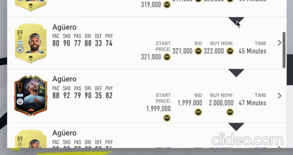

# FutBot

This is a very simple data source/trade bot for FIFA 20 fut api written in Typescript/Javascript for node.js.  
The main purpose is to automate simple activities. There is no intention to create a complete api as futapi.  
To inject your session into node server, there is a chrome extension in the project. This extension is also drawing on fut web app, so that you can access features easily.
It's tested with FIFA 20

**IMPORTANT**
I will change this repository to private in 2 days. For future releases or to get a collaborator role, join the Discord server.

## Table of contents

**[Use Latest stable version](#use-latest-stable-version)**<br>

**[Dev Mode](#dev-mode)**<br>
**[Prepare (Dev Mode)](#prepare)**<br>
**[Start (Dev Mode)](#start)**<br>

**[Existing features](#existing-features)**<br>
**[Existing UI Features](#existing-ui-features)**<br>

**[What to do on errors](#what-to-do-on-errors)**<br>
**[Disclaimer and Notes](#disclaimer-and-notes)**<br>
**[Known Bugs](#known-bugs)**<br>

**[Discord](#discord)**<br>

## Use Latest stable version

Go to [releases page](https://github.com/dogancana/futbot/releases) and select 'futbot.zip' under assest of **latest stable version**.  
In this file you'll find executable version for server and ready to use chrome extension.  
Activate developer mode in chrome://extensions page and click 'Load Unpacked' to load Futbot extension. The extension is there to read your session data and send it to server, so it's essential. If you get new version of the extension, you need to load it again. There is no automatic update because I cannot put this extension to chrome market.  
When you are done with the extension, you can start the server. Server needs .env file to be present in the same directory, so that you can configure necessary parameters (In future this will be moved to UI). Note, whenever you need to change something in .env file, you need to restart the server.  
Now you are all set to use existing features described later in this documentation.  
**Note for people outside of Europe**: You need to change 'FUTBOT_FUT_API_ENDPOINT_OVERWRITE' value in .env file. Once you load the extension, go to fut web app and click to Futbot extension. It should tell you the endpoint. Just use that value and restart your server.

## Dev Mode

If you have an issue starting the server from last stable version, you can execute the app directly from source code. Or if you know what you are doing, just use dev mode :)

### Prepare (Dev Mode)

`Node and yarn`  
Install [node](https://nodejs.org/en/) and [yarn](https://yarnpkg.com/lang/en/docs/install/). Installing yarn via installation scripts are generally easier.

`Config`  
The project needs a configuration file (.env) in order to get some user preferences and region based api endpoint. You can copy .env.local file as .env file.  
**Don't forget to read what's inside .env file.** Especially if you are outside of Europe or if you have/had more than one origin account (it goes years back) or if you switched platforms before.

### Start (Dev Mode)

Start the server

```sh
$ yarn
$ yarn dev
```

Go to ui folder and build extension first (use node version 8-9)

```sh
$ yarn
$ yarn build
```

Load the extension in developer mode to chrome. Build output should be under /ui/build  
Login to fut web app so that the extension can steal your session and inject it into node server.
Since this server is not intented to be deployed somewhere, there is no session in node server. Instead, your Fut web app session will be shared for any task in the server.

## Existing features:

### How Jobs Work

In futbot, there are different apps such as '/trade-bot', '/invest' and 'auto-buyer'.  
Each app comes with it's own different jobs.

To start a job, you can simply call  
 `/<app-name>/start-<job-name>?<parameters-if-any>`

To stop a job till you start/restart again  
 `/<app-name>/stop-<job-name>?<parameters-if-any>`

If you want to restart a job with new parameters:  
 `/<app-name>/restart-<job-name>?<parameters-if-any>`  
Note: this will clear your report for that job.

If you want to finish a job:  
 `/<app-name>/finish-<job-name>?<parameters-if-any>`

### Club

http://localhost:9999/club/non-squad-players  
This just returns your players in club which are not in your actice squad and not in trade pile.  
The list would be used for /trade-bot/start-selling job.

### Trade Bot

http://localhost:9999/trade-bot/start-sell-unused?maxRating=83  
These will control selling players who are not in your active squad.
Once in a while it gets your players from club, figures a good price according to futbin/fut market data. And sells them if prices are trustable enough.

http://localhost:9999/trade-bot/start-sell-trade-pile  
Relisting job is pretty similar to selling unused players. Only difference is, this job will only focus on players in your trade pile. It can relist an item or you can send players to transfer list and start this job to start selling them.

http://localhost:9999/trade-bot/clear-pile  
This will clear transfer list from sold/expired items. It will send everything to club. If there are duplicates, it'll sell them.

### Investor

http://localhost:9999/invest/start-low-players?budget=50000&min=1000&max=5000&maxTargetPool=150  
This job targets most liked futbin players in your min-max range. It saves the list of players (max target pool is max limit for this), calculates their prices and searches market for auctions with lower buy now price than optimal price, e.g. buy at 59th min.  
You can set FUTBOT_PROFIT_MARGIN in .env file to effect this calculation.

http://localhost:9999/invest/start-good-auctions?budget=50000&min=5000&max=10000  
This is similar to low players investor job. Only difference is, this job is focused on expensive players with low current bid amounts, e.g. trades with 1min remaining.  
You can set FUTBOT_PROFIT_MARGIN in .env file to effect this calculation.  
`Known issue`: Currently this job takes a bit long time to put an offer and it rarely buy players. You can use low-player invest job till this is fixed in future releases.

### Auto Buyer

http://localhost:9999/auto-buyer/start-buy-now  
http://localhost:9999/auto-buyer/start-buy-query  
Endpoints to control auto buyer jobs. You don't need to start these as they will be automatically started once you add a target player or target query.

http://localhost:9999/auto-buyer/targets  
It'll list your target players and target queries if any.

**Sniping Players** (Auto Buy Now):  
Auto buyer feature is activated from futbot additions to UI.  
Whenever you see a player, there will be a triangle icon to show player details and add target options. You can specify a buy value for this target and auto buyer will try to buy him for less than the price you provided.  
You can optionaly provide a sell price. If a sell price is present, targets will be immediately sold.  
If you wish to change buy value or sell value, just search the same target and add him again with new values.

**Sniping search results** (Auto Query):  
You can also search your last transfer search from transfer results page. This feature is really similar to sniping players. Only difference is, auto buy query will buy whatever pops up for your query. So, you don't need to specify a price limit, as you can already specify it in your search criteria.  
However you can still specify a sell price, which works exactly as in players.

Here is an example of auto buy query, which tries to buy any special player under 3000 coins. They will be sold for 4400.


**NOTE:** In order to bypass EA caches, min current bid and min buy now filters are automatically set. Don't use min current bid and min buy now values, otherwise you'll get an error (460);

**DISCLAIMER:** This feature will buy whatever pops up after your query. Which means, it can buy more than 50 player in less than 10 seconds. Use really carefully!

### General

http://localhost:9999/jobs/start-favourites  
You can start a set of jobs from one endpoint. You can configure this in .env file. Look for FUTBOT_FAVOURITE_JOBS value in there and configure for your own needs.

http://localhost:9999/jobs/list  
http://localhost:9999/jobs/stop-all  
http://localhost:9999/jobs/resume-all  
These endpoints are pretty straitghforward. They show an overall look of currently running tasks/jobs. They also include their individual reports.

http://localhost:9999/jobs/save-jobs  
http://localhost:9999/jobs/load-jobs  
You can save & load the jobs through these endpoints.  
Saving jobs will only save currently running jobs into a file called jobs.json. Feel free to modify this file without breaking the formatting.  
Once you saved current jobs, you can load them in your next run.

http://localhost:9999/jobs/start-slow-down?min=15&max=45  
This is a job which will be sleeping for FUTBOT_SLOW_DOWN_JOB_DURATION of time (.env file).  
You can also configure how frequent this will be by setting FUTBOT_JOB_IMP_SLOW_DOWN value in .env file.

http://localhost:9999/stats  
Shows statistics about api usage for fut & futbin.

http://localhost:9999/feedback  
Feedback combines /stats, /jobs/list and .env file values to show state of your application.  
It's usefull when you want to ask a question, report a bug, give a feedback or just share big profits!

### Pricing

Futbot calculates pricing always from actual market. While doing the caculation, it uses futbin as a filter.  
Checking price information of a player follows below steps:

- Get futbin price of the player
- Search market with max bay value as 130% of futbin price.
- If there are less than 2 results, increase max buy price by 5% and continue searching.
- If there are more than 10 results, get lowest buy now value in the results and search again with that value.
- Stop after FUTBOT_MAX_PRICING_SEARCH_TRY tries (defined in .env).
- If a price cannot be found in FUTBOT_MAX_PRICING_SEARCH_TRY tries but we already checked more than 10 samples, calculate price depending on those samples.

### Quick Selling

Futbot can sell a player in many different jobs. Whenever it's trying to sell a player, quick sell price of the relevant player will be checked. If optimal selling price is too close to quick sell price, player will be discarded.  
The value is controlled with FUTBOT_QUICK_SELL_MARGIN value defined in .env file. Default value is 200. Set to 0 to disable.  
**Example:** One player has optimal sell price of 750. But it can be quick sold for 603. Futbot will choose to discard player with FUTBOT_QUICK_SELL_MARGIN=200 value. If you set FUTBOT_QUICK_SELL_MARGIN=100, Futbot will send the player to transfer list.

## Existing UI Features

`Player prices:`  
`Add auto buy target:`  
The extension will add small visual components to players.  


## What to do on errors

Once in a while you'll get authentication errors from futbin and fut. The reason would be either fut session expired (401,403), fut requires validation (458) or futbin temporary ban (403).  
The application stops after receiving these errors. But you need to refresh fut web app and login again, so that the extension can send new auth token to the server. After this, the jobs should automatically restart. You can validate if jobs are still in 'stoped' state by checking http://localhost/jobs/list. If they didn't start automatically, just call http://localhost/jobs/resume-all.  
Futbin servers ban your IP address for 6-12 hours. Once you get banned from futbin, application will still work but it will be really slow. If you wish to continue, you can change your IP address (restart modem, use different VPN server) and restart the app.

## Disclaimer and Notes

I'm pretty sure this would violate some terms and conditions. Use on your own risk  
The requests against fut api and futbin api are limited per minute. The values should be good enough to execute the bot for couple of hours. You can check request stats from http://localhost:9999/stats  
In case of temporary ban from fut api, jobs will be stopped automatically. If you are banned from futbin, bot won't make any requests to futbin for next couple of hours.
I'm trying all the features from my profile. I generally try it with all quality (including specials). But still there might be weird edge cases which can cause bugs or losses.

## Known Bugs

- Currently, the server gets wrong rating value for special cards. So, parameters such as maxRating is effected. (Nothing wrong with prices.)

## Discord

Join [this](https://discord.gg/WJQsv6h) discord server if you have any questions/suggestions. You can also share some feedback for possible enhancements to the bot.
